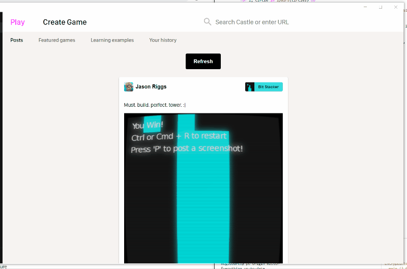

# Castle UI API



The Castle UI API allows you to add user interface elements that allow interaction with your game. Castle manages the laying out of your UI relative to the rest of Castle's UI. Uses can range from simple debug tools while developing games to user-facing level editors or text-based adventure games etc.

## Tutorial (OUT OF DATE)

**WARNING: The tutorial is currently out of date, and will be updated soon! The [Reference](#reference) section below is up-to-date though!**

To use the UI API, simply define the `castle.uiupdate` function and put your UI calls in it:

```lua
function castle.uiupdate()
    castle.ui.text('Hello, world!')
end
```

Since using UI elements usually involves a lot of calls to functions in the `castle.ui` module, it helps to make a local variable referencing it:

```lua
local ui = castle.ui

function castle.uiupdate()
    ui.text('Hello, world!')
end
```

Elements that work as inputs usually take an id string (to keep track of which element refers to which value) and the current value, then return the new value:

```lua
local ui = castle.ui

local myString = 'Edit me!'

function castle.uiupdate()
    ui.text('Set myString:')
    myString = ui.textArea('myString', myString)
end

function love.draw()
    love.graphics.print('myString:\n' .. myString, 20, 20)
end
```

A 'range input' (shown as a slider) takes the minimum and maximum of the range along with a 'step' to slide the value by when dragging:

```lua
local ui = castle.ui

local myNumber = 20
local myString = 'Edit me!'

function castle.uiupdate()
    ui.text('Set myNumber:')
    myNumber = ui.rangeInput('myNumber', myNumber, 0, 40, 1)

    ui.text('Set myString:')
    myString = ui.textArea('myString', myString)
end

function love.draw()
    love.graphics.print('myNumber: ' .. myNumber, 20, 20)
    love.graphics.print('\n\nmyString:\n' .. myString, 20, 20)
end
```

`castle.uiupdate`, like `love.draw`, is called repeatedly at a certain frequency. For the UI this is currently 20 times a second, which seems to make for reasonable responsiveness. On each update, you just need to describe the UI for the current state of your game, and don't have to worry about removing or updating the state of 'old' UI elements. Simply don't make a call to have something not be displayed. In this sense, UI calls are like LÖVE draw calls.

```lua
local ui = castle.ui

local shouldShowText = true

function castle.uiupdate()
    shouldShowText = ui.checkBox('Show text', shouldShowText)
    
    if shouldShowText then
        ui.text('The display of this text is toggled by the above checkbox!')
    end
end
```

`inner` arguments are for nesting components -- you just pass a function that makes more UI calls. ids only need to be unique within the parent component. You can also use callbacks for certain events (more docs coming soon!):

```lua
local ui = castle.ui

function castle.uiupdate()
    ui.box({
        pad = 'small',
        gap = 'small',
        border = { color = 'yellow', size = 'large' }
    }, function()
        ui.text('This is some text inside a box!')

        if ui.button('Button 1') then
            print('Button 1 pressed!')
        end

        ui.button('Button 2', {
            onClick = function()
                print('Button 2 pressed!')
            end
        })
    end)
end
```

See the [code for the 'Circles' demo](./circles.lua) for an example of showing UI for many game entities.

## Reference

All functions take some required parameters, and one `props` parameter for additional configuration. All keys in `props` are optional. `props` itself is always optional and defaults to `{}`.

Parent components (components that have more components inside) take an `inside` parameter. The `inside` parameter should be a function that makes more UI calls -- the components created by these calls then become children of the parent component.

Input components generally have required label and value parameters. Labels are strings shown next to inputs to describe their function, and are also used by the system to distinguish the inputs from each other. Value parameters provide the current value of the input. Input components generally return the new values (which may be equal to the values passed in if no changes were made by the user).

### Button

Allows the user to perform an action by clicking.

```
clicked = ui.button(label, props)
```

**Arguments**

- `label` (*string*, required): The label
- `props` (*table*, optional): The table of props:
    - `disabled` (*boolean*): Whether the button should be disabled
    - `big` (*function*): Whether the button should be a bigger variant.
    - `kind` (*string*): One of `'primary'`, `'secondary'`, `'danger'` or `'ghost'`. Is `'secondary'` by default. A 'primary' button is highlighted and meant for important actions. A 'danger' button is meant for dangerous actions (such as deleting something). A 'ghost' button has even less visual dominance than a secondary button.
    - `onClick` (*function*): A function to call when the button is clicked. You can use this instead of using the return value directly if you prefer callbacks.

**Returns**

- `clicked` (*boolean*): Whether the button was clicked in this update.

### Checkbox

Allows the user to toggle a boolean value. Checkboxes generally represent one input in a larger flow with a final confirmation step (eg. choosing among many settings then clicking a button to perform an action with those settings). Prefer [toggle switches](#toggle) instead if the resulting action immediately affects something in your game without another step.

```
newChecked = ui.checkbox(label, checked, props)
```

**Arguments**

- `label` (*string*, required): The label
- `checked` (*string*, required): Whether currently checked
- `props` (*table*, optional): The table of props:
    - `indeterminate` (*boolean*): Whether the checkbox is in an 'indeterminate' state between checked and unchecked. This useful when you want to express that the checkbox has a sublist of selections, some selected and some unselected.
    - `disabled` (*boolean*): Whether the input should be disabled
    - `hideLabel` (*boolean*): Whether to hide the label
    - `onChange` (*function*): A function to call with the new value whenever the input is updated. You can use this instead of using the return value directly if you prefer callbacks. If your function returns a value, that value is used as the new value instead.

**Returns**

- `newChecked` (*string*): The new checked state. Is equal to `checked` if no change occured in this update.

### Dropdown

Allows the user to select from list of values.

```
newValue = ui.dropdown(label, value, items, props)
```

**Arguments**

- `label` (*string*, required): The label
- `value` (*string*, required): The current value. Must be one of the values in `items`, or `nil` to indicate that nothing has been selected. When nothing is selected, the control displays `props.placeholder`, which defaults to `'Select an option...'`.
- `items` (*table*, required): A table containing strings that are possible values for the user to select from. The table is expected to be in the form of a Lua array, eg. `{ 'option1', 'option2', 'option3' }`.
- `props` (*table*, optional): The table of props:
    - `disabled` (*boolean*): Whether the input should be disabled
    - `placeholder` (*string*): Text to show when no item is selected (i.e., `value` is `nil`). Defaults to `'Select an option...'`.
    - `hideLabel` (*boolean*): Whether to hide the label
    - `invalid` (*boolean*): Whether the value is currently invalid
    - `invalidText` (*string*): An error message to display when the value is invalid
    - `helperText` (*string*): Text that is used alongside the label for additional help
    - `onChange` (*function*): A function to call with the new value whenever the input is updated. You can use this instead of using the return value directly if you prefer callbacks. If your function returns a value, that value is used as the new value instead.

**Returns**

- `newValue` (*string*): The new value input by the user. Is equal to `value` if no change occured in this update.

### Number input

Allows the user to input a number. Contains controls to increase or decrease the number incrementally.

```
newValue = ui.numberInput(label, value, props)
```

**Arguments**

- `label` (*string*, required): The label
- `value` (*number*, required): The current value
- `props` (*table*, optional): The table of props:
    - `disabled` (*boolean*): Whether the input should be disabled
    - `hideLabel` (*boolean*): Whether to hide the label
    - `min` (*number*): The minimum value
    - `max` (*number*): The maximum value
    - `step` (*number*): How much the value should increase or decrease when clicking the up or down button
    - `invalid` (*boolean*): Whether the value is currently invalid
    - `invalidText` (*string*): An error message to display when the value is invalid
    - `helperText` (*string*): Text that is used alongside the label for additional help
    - `onChange` (*function*): A function to call with the new value whenever the input is updated. You can use this instead of using the return value directly if you prefer callbacks. If your function returns a value, that value is used as the new value instead.

**Returns**

- `newValue` (*string*): The new value input by the user. Is equal to `value` if no change occured in this update.

### Radio button group

For selecting from a list of two or more options that are mutually exclusive (only one can be selected).

```
newValue = ui.radioButtonGroup(label, value, items, props)
```

**Arguments**

- `label` (*string*, required): The label
- `value` (*string*, required): The current value. Must be one of the values in `items`.
- `items` (*table*, required): A table containing strings that are possible values for the user to select from. The table is expected to be in the form of a Lua array, eg. `{ 'option1', 'option2', 'option3' }`.
- `props` (*table*, optional): The table of props:
    - `disabled` (*boolean*): Whether the input should be disabled
    - `hideLabel` (*boolean*): Whether to hide the label
    - `helperText` (*string*): Text that is used alongside the label for additional help
    - `onChange` (*function*): A function to call with the new value whenever the input is updated. You can use this instead of using the return value directly if you prefer callbacks. If your function returns a value, that value is used as the new value instead.

**Returns**

- `newValue` (*string*): The new value input by the user. Is equal to `value` if no change occured in this update.

### Section

An expandable section with a label, containing more UI elements inside. Helps with grouping and reducing clutter.

```
newOpen = ui.section(label, props, inner)
newOpen = ui.section(label, inner)
```

**Arguments**

- `label` (*string*, required): The section title
- `props` (*table*, optional): The table of props:
    - `open` (*boolean*): Whether the section should be currently open. If you leave this out, the section has normal open / close toggling behavior. If you provide this value, the section always reflects this value. The return value of the function will be `true` if the user clicked on the section to open it, but if you pass `false` for this parameter, it will still not open. Thus, you can override the default behavior.
- `inner` (*function*, required): A function that makes UI calls defining contents of this section.

**Returns**

- `newOpen` (*boolean*): Whether the section is open.

### Slider

Indicates a number visually and allows the user to adjust it by dragging a handle along a horizontal track.

```
newValue = ui.slider(label, value, min, max, props)
```

**Arguments**

- `label` (*string*, required): The label
- `value` (*number*, required): The current value
- `min` (*number*, required): The minimum value
- `max` (*number*, required): The maximum value
- `props` (*table*, optional): The table of props:
    - `disabled` (*boolean*): Whether the input should be disabled
    - `hideTextInput` (*boolean*): Whether to hide the number input box that appears next to the slider allowing direct entry
    - `hideLabel` (*boolean*): Whether to hide the label
    - `minLabel` (*string*): The label associated with the minimum value
    - `maxLabel` (*string*): The label associated with the maximum value
    - `step` (*number*): How much the value should increase or decrease when sliding the handle by mouse
    - `stepMultiplier` (*number*): How much the value should increase or decrease when using shift + arrow keys (the actual step will be `(max - min) / stepMultiplier`)
    - `onChange` (*function*): A function to call with the new value whenever the input is updated. You can use this instead of using the return value directly if you prefer callbacks. If your function returns a value, that value is used as the new value instead.

**Returns**

- `newValue` (*string*): The new value input by the user. Is equal to `value` if no change occured in this update.

### Tabs

For choosing between multiple views in the same context. There are two functions involved: one is `ui.tabs` which is a parent in which you put a group of tabs, and the other is `ui.tab` which represents each tab in the group and contains the components that should be visible in that tab inside it. So, an example layout of these calls could be:

```lua
ui.tabs('tab group 1', function()
    ui.tab('Tab 1', function()
        -- Content of tab 1
    end)
    ui.tab('Tab 2', function()
        -- Content of tab 2
    end)
end)
```

#### `ui.tabs`

```
ui.tabs(id, props, inner)
ui.tabs(id, inner)
```

**Arguments**

- `id` (*string*, required): An identifying string for this tab group. Needs to be unique within the parent of the tab group. This id isn't displayed anywhere and is just used internally to distinguish tab groups from each other.
- `props` (*table*, optional): The table of props:
    - `selected` (*number*): The index of the currently selected tab. Use this if you want to control which tab is selected.
- `inner` (*function*, required): A function that makes `ui.tab` calls defining each tab in this group. Any non-`ui.tab` calls are ignored.

**Returns**

This function doesn't return anything

#### `ui.tab`

```
newOpen = ui.tab(label, props, inner)
newOpen = ui.tab(label, inner)
```

**Arguments**

- `label` (*string*, required): The section title
- `props` (*table*, optional): The table of props:
    - *Currently `ui.tabs` doesn't have any props, some may be added later*
- `inner` (*function*, required): A function that makes UI calls defining contents of this tab.

**Returns**

- `newOpen` (*boolean*): Whether this tab is open.

### Text area

Allows the user to input a string. The display for the field is multi-line, so if you expect only short single-line strings to be input prefer using a [text input](#text-input) instead.

```
newValue = ui.textArea(label, value, props)
```

**Arguments**

- `label` (*string*, required): The label
- `value` (*string*, required): The current value
- `props` (*table*, optional): The table of props:
    - `disabled` (*boolean*): Whether the input should be disabled
    - `placeholder` (*string*): Text to show when the input is empty. It disappears when the user begins entering data and should not contain crucial information. It does not affect the actual value returned.
    - `rows` (*string*): The initial height of the text area in number of rows of text.
    - `hideLabel` (*boolean*): Whether to hide the label
    - `invalid` (*boolean*): Whether the value is currently invalid
    - `invalidText` (*string*): An error message to display when the value is invalid
    - `helperText` (*string*): Text that is used alongside the label for additional help
    - `charCount` (*boolean*): Whether to show the character count
    - `maxLength` (*number*): The maximum allowed value length
    - `onChange` (*function*): A function to call with the new value whenever the input is updated. You can use this instead of using the return value directly if you prefer callbacks. If your function returns a value, that value is used as the new value instead.

### Text input

Allows the user to input a string. The display for the field is just a single line, so if you expect multi-line strings to be input prefer using a [text area](#text-area) instead.

```
newValue = ui.textInput(label, value, props)
```

**Arguments**

- `label` (*string*, required): The label
- `value` (*string*, required): The current value
- `props` (*table*, optional): The table of props:
    - `disabled` (*boolean*): Whether the input should be disabled
    - `placeholder` (*string*): Text to show when the input is empty. It disappears when the user begins entering data and should not contain crucial information. It does not affect the actual value returned.
    - `hideLabel` (*boolean*): Whether to hide the label
    - `invalid` (*boolean*): Whether the value is currently invalid
    - `invalidText` (*string*): An error message to display when the value is invalid
    - `helperText` (*string*): Text that is used alongside the label for additional help
    - `charCount` (*boolean*): Whether to show the character count
    - `maxLength` (*number*): The maximum allowed value length
    - `onChange` (*function*): A function to call with the new value whenever the input is updated. You can use this instead of using the return value directly if you prefer callbacks. If your function returns a value, that value is used as the new value instead.

**Returns**

- `newValue` (*string*): The new value input by the user. Is equal to `value` if no change occured in this update.

### Toggle

Allows the user to toggle a boolean state. Toggle switches are generally used if the resulting action immediately affects something in your game without another step. Use a checkbox instead if the input just represents one value in a larger flow that includes a later confirmation step.

```
newToggled = ui.toggle(labelA, labelB, toggled, props)
```

**Arguments**

- `labelA` (*string*, required): The label when in on state
- `labelB` (*string*, required): The label when in off state
- `toggled` (*string*, required): Whether currently on
- `props` (*table*, optional): The table of props:
    - `onToggle` (*function*): A function to call with the new value whenever the input is updated. You can use this instead of using the return value directly if you prefer callbacks. If your function returns a value, that value is used as the new value instead.

**Returns**

- `newValue` (*string*): The new value input by the user. Is equal to `value` if no change occured in this update.
